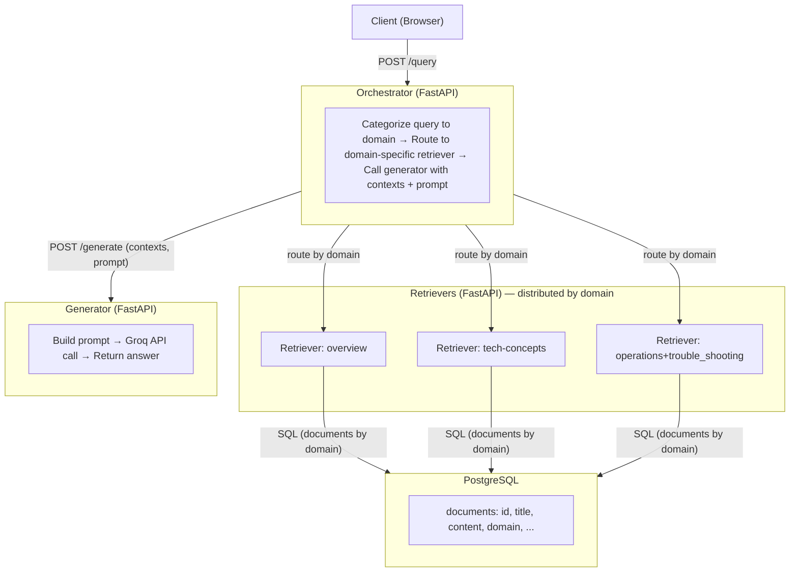

# Distributed RAG

A **distributed Retrieval-Augmented Generation (RAG)** system that answers user questions by retrieving relevant documents from a vector store and generating answers using an LLM. The system is split into separate services (orchestrator, retriever, generator) so each can be scaled and deployed independently.

## Features

- **Domain-aware retrieval**: Queries are categorized into domains (e.g. `overview`, `concepts`); the orchestrator routes to the appropriate retriever.
- **Vector search**: Documents are embedded with [Sentence Transformers](https://www.sbert.net/) and indexed with pgvector for fast similarity search.
- **LLM generation**: Answers are generated via [Groq](https://groq.com/) (configurable model).
- **PostgreSQL-backed documents**: Document metadata and content are stored in PostgreSQL; the retriever loads by domain and builds hnsw index stored in pgvector. 

## Architecture Overview



- **Orchestrator**: Single entry point. Classifies the query into a domain, calls the right retriever, then the generator; returns the final answer.
- **Retriever**: Per-domain (or shared) service. Reads documents from PostgreSQL for its `DOMAIN`, embeds them, builds an index, and serves `/query` for semantic search.
- **Generator**: Accepts a list of contexts and the user prompt, builds a RAG prompt, calls the LLM (Groq), returns `{ answer, model, latency_ms }`.
- **PostgreSQL**: Stores the `documents` table and acts as the source of truth; schema in `retriever/init_db.sql`.


## Project Structure

```
├── orchestrator/          # Query routing, domain classification, orchestration
├── retriever/             # Document loading, embedding, /query API
├── generator/             # Prompt building, Groq LLM, /generate API
├── client/                # Optional React + Vite chat UI (proxies to orchestrator)
├── docs/                  # Architecture, PostgreSQL, troubleshooting
├── scripts/               # setup-venv.sh, run-all.sh, etc.
└── docker-compose.yml     # postgres(pgvector), retriever, generator, orchestrator
```

## Quick Start

### Using Docker Compose

1. **Orchestrator**: Create `orchestrator/.env` with:
   - `GENERATOR_URL=http://generator:8000/generate`
   - `RETRIEVER_OVERVIEW_URL=http://retriever:8000/query`
   - `RETRIEVER_CONCEPTS_URL=http://retriever:8000/query`

2. **Generator**: Create `generator/.env` with:
   - `GROQ_API_KEY=<your-groq-api-key>`
   - `MODEL_NAME` (optional, default used if not set)

3. **Run stack**:
   ```bash
   docker compose up -d
   ```
   - Orchestrator: http://localhost:8000  
   - Generator: http://localhost:8001  
   - Retriever: http://localhost:8002  
   - Postgres: localhost:5432  

4. **Query**:
   ```bash
   curl -X POST http://localhost:8000/query \
     -H "Content-Type: application/json" \
     -d '{"query_text": "What is this project about?", "top_k": 5}'
   ```

### Local development (without Docker)

1. **PostgreSQL**: Run Postgres (e.g. `docker compose up -d postgres`) and apply `retriever/init_db.sql` if needed.
2. **Python env**: `./scripts/setup-venv.sh` then activate the venv.
3. **Environment**: Set `.env` in `orchestrator/`, `generator/`, `retriever/` (see each service and `docs/POSTGRES_CONNECTION.md`).
4. **Run services**: `./scripts/run-all.sh` (or run orchestrator, retriever, generator in separate terminals).

### Optional: Chat client

- **Dev**: From `client/`, run `npm install && npm run dev` (e.g. http://localhost:5173). Point the app at the orchestrator (e.g. Vite proxy `/api` → `http://localhost:8000`).
- **Prod**: Build and serve the client (e.g. nginx) and proxy `/api` to the orchestrator.

## Configuration

| Component     | Key env vars |
|--------------|----------------|
| Orchestrator | `GENERATOR_URL`, `RETRIEVER_OVERVIEW_URL`, `RETRIEVER_CONCEPTS_URL` |
| Retriever    | `DATABASE_URL`, `DOMAIN` (e.g. `overview`, `concepts`) |
| Generator    | `GROQ_API_KEY`, `MODEL_NAME` |

Domain classification uses `orchestrator/domain_samples.json`: each key is a domain name, and the value is a list of example queries used to compute domain embeddings. The orchestrator embeds the user query and picks the domain with the highest similarity.